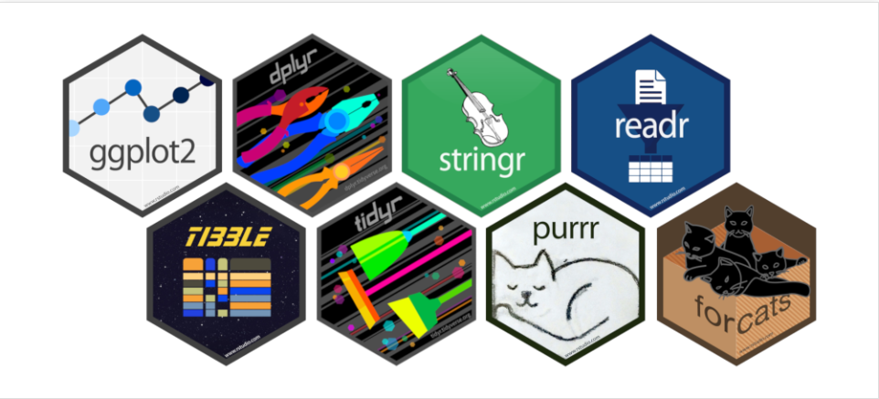

<link rel="shortcut icon" href="favicon.ico">

:::::: {.columns}
::: {.column width="48%" data-latex="{0.48\textwidth}"}

*IEDES - Master mention "Etudes du Développement"*

Master 1

**Development Measurement**

**Econometrics**

<!---
- The classical regression model

- Heteroscedasticity

- Non-linear models

--->

**Tutored Projects in Development Economics**

**Data Exploration and Modelling (Inequalities, Discrimination)*

---

Master 2

[**Climate and Data**](https://jeanbaptisteguiffard.github.io/courses_climatedata.html)

To become familiar with climate issues and to understand the construction of sustainable development indicators, this course proposes: 

1. Intensive training in R software 

2. Advanced skills in data collection, processing, and analysis on R (graphical representations, maps, data extractions, web scraping, textual analysis. . . )

3. A common theme: climate data and sustainable development indicators.

<!---
**Statistics with R**

Lessons:

- The Basics of R

- Measurement and Descriptive Statistics

- Inference and Statistical Tests

- Simple and Multiple Regressions

--->

:::
::: {.column width="4%" data-latex="{0.04\textwidth}"}
\ 
<!-- an empty Div (with a white space), serving as
a column separator -->
:::
:::::: {.column width="48%" data-latex="{0.48\textwidth}"}
**Ressources**

{ width=50%}

- [Cheatsheet Base R](courses/ressources/R/Cheatsheet_BASE_R.pdf)

- [Cheatsheet DPLYR and TIDYR R](courses/ressources/R/Cheatsheet_DPLYR_TIDYR_R.pdf)

- [Cheatsheet GGPLOT R](courses/ressources/R/Cheatsheet_GGPLOT2_R.pdf) 

:::
::::::
\newline

