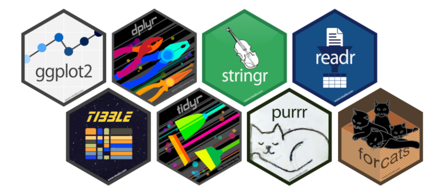

```{r, echo=FALSE}
# Ce bloc de code est optionnel si vous avez besoin d'intégrer du code R

```

<style> 
    @import url('https://fonts.googleapis.com/css2?family=Roboto:wght@300;400;700&display=swap');
    
  BODY { 
    margin: 1em 0em 1em 0em; 
    font-family: Verdana, Geneva, Arial, Helvetica, sans-serif; 
    font-size: 11pt; 
  } 

  h1 { 
    color: #003366; 
    font-size: 150%; 
    font-weight: normal; 
    text-align: center; 
  } 

  h2 { 
    color: #003366; 
    font-size: 140%; 
    font-weight: normal; 
  } 

  h2 a { 
    color: #003366; 
  } 

  h3 { 
    font-weight: normal; /* Maintient le poids léger pour la lisibilité */
    font-size: 1.3em; /* Agrandit légèrement le texte pour plus de visibilité */
    letter-spacing: 0.05em; /* Ajoute un peu d'espacement entre les lettres pour aérer */
    color: #003366; /* Harmonise la couleur avec le reste du site */
    text-align: left; /* Ajuste l'alignement à gauche, modifiable si nécessaire */
    margin-top: 1em; /* Ajoute un espace au-dessus pour éviter que les titres ne soient trop proches d'autres éléments */
    margin-bottom: 0.5em; /* Espace en dessous pour mieux séparer des paragraphes */
}

  TABLE { 
    border: 0; 
    height: 100%; 
  } 

  A:link { 
    text-decoration: none; 
    color: #003366; 
  } 

  A:visited { 
    text-decoration: none; 
    color: #9FA7FD; 
  } 

  A:hover { 
    text-decoration: underline; 
    color: #003366; 
  } 

  ul { 
    line-height: 1.5em; 
    margin: 0.5em 0 0 2em; 
    padding: 0; 
  } 

  li { 
    margin: 0.4em 0; 
  } 

  ul { 
    list-style-type: square; 
    list-style-image: url('list_blue_square.jpg'); 
  } 

  ul ul { 
    list-style-type: disc; 
    list-style-image: url('list_blue_arrow.jpg'); 
  } 

  ul ul ul { 
    list-style-type: circle; 
    list-style-image: url('list_blue_hyphen.jpg'); 
  } 

  .top-container { 
    background-color: #FFFFFF; 
    padding: 8px; 
    text-align: center; 
  } 

  .header { 
    padding: 10px 16px; 
  } 

  .collapsible { 
    background-color: #ffffff; 
    color: #003366; 
    cursor: pointer; 
    padding: 18px; 
    width: 100%; 
    border: none; 
    text-align: justify; 
    outline: none; 
    font-size: 15px; 
  } 

  .active, .collapsible:hover { 
    background-color: #f5f6ff; 
  } 

  .contentcoll { 
    padding: 0 18px; 
    display: none; 
    overflow: hidden; 
    text-align: justify; 
  } 

  .sticky { 
    position: fixed; 
    top: 0; 
    width: 100%; 
  } 

  .sticky + .content { 
    padding-top: 102px; 
  } 

  .topnav { 
    overflow: hidden; 
    background-color: #FFFFFF; 
    text-align: center; 
    border-bottom: solid 1px #003366; 
    width: 90%; 
    margin: auto; 
  } 

  .topnav a { 
    float: left; 
    display: block; 
    color: #003366; 
    text-align: center; 
    padding: 18px 18px; 
    text-decoration: none; 
    font-size: 17px; 
  } 

  .topnav a:hover { 
    color: #003366; 
    background-color: #f5f6ff; 
  } 

  .topnav .icon { 
    display: none; 
  } 

  @media screen and (max-width: 600px) { 
    .topnav a:not(:first-child) { 
      display: none; 
    } 

    .topnav a.icon { 
      float: right; 
      display: block; 
    } 
  } 

  @media screen and (max-width: 600px) { 
    .topnav.responsive { 
      position: relative; 
    } 

    .topnav.responsive .icon { 
      position: absolute; 
      right: 0; 
      top: 0; 
    } 

    .topnav.responsive a { 
      float: none; 
      display: block; 
      text-align: left; 
    } 
  } 
  
  .header {
    display: flex;
    justify-content: center; /* Centers the content horizontally */
    align-items: center;     /* Centers the content vertically */
    height: 100px;           /* Adjust the height of the header */
  }

  .topnav {
    display: flex;           /* Aligns the links in a row */
    gap: 20px;               /* Adds space between the links */
  }

  .topnav a {
    padding: 14px 20px;
    text-decoration: none;
    font-size: 17px;
    color: #003366;
  }

  .topnav a:hover {
    background-color: #f5f6ff;
    color: #003366;
  }
  
  .social-links img {
    width: 30px;
    margin-right: 10px;
    transition: transform 0.2s;
  }

  .social-links img:hover {
    transform: scale(1.1);
  }
  
  .rounded-image {
    max-width: 90%; /* Ensures the image is responsive within its container */
    height: auto; /* Maintains the image's aspect ratio */
    border-radius: 10px;
    box-shadow: 0px 2px 8px rgba(0, 0, 0, 0.2);
    margin-bottom: 20px; /* Adds space below the image */
    margin-left: auto; /* Centrer horizontalement l'image si le conteneur a une largeur définie */
    margin-right: auto; /* Centrer horizontalement l'image si le conteneur a une largeur définie */
    margin-left: 15px; /* Ajoute une marge à gauche */
    margin-right: 15px; /* Ajoute une marge à droite */
  }
  .figure {
    flex: 1 1 40%; /* Allows flexibility in taking up to 40% of the container */
    text-align: center; /* Centers the image within the figure block */
  }
</style> 

<link rel="shortcut icon" href="favicon.ico">


<!---
<p>
<div class="row">
<figure>
  
</figure>
</div>
</p>

---->


<h2 class="section-title">IEDES - Master mention Etudes du Développement</h2>


**Master 1 - Econometrics**

This course deepens the basics of econometrics, providing students with a solid understanding of the estimation and modelling techniques essential for analysing economic problems related to development. The following topics will be covered: 

1. The classical regression model

2. Properties of the OLS estimator in large samples

3. Heteroscedasticity: The problem and correction methods

4. Non-linear models: Probit and Logit

5. Count models: Poisson models

<!---
- The classical regression model

- Heteroscedasticity

- Non-linear models

**Data Exploration and Modelling (Inequalities, Discrimination)**

**Tutored Projects in Development Economics**
--->

---

[**Master 2 - Climate and Data**](https://jeanbaptisteguiffard.github.io/courses_climatedata.html)


To become familiar with climate issues and to understand the construction of sustainable development indicators, this course proposes: 

1. Intensive training in R software 

2. Advanced skills in data collection, processing, and analysis on R (graphical representations, maps, data extractions, web scraping, textual analysis. . . )

3. A common theme: climate data and sustainable development indicators.


<!---
**Statistics with R**

Lessons:

- The Basics of R

- Measurement and Descriptive Statistics

- Inference and Statistical Tests

- Simple and Multiple Regressions

--->


----

<h2 class="section-title">Ressources</h2>

{ width=100%}

- [Cheatsheet Base R](courses/ressources/R/Cheatsheet_BASE_R.pdf)

- [Cheatsheet DPLYR and TIDYR R](courses/ressources/R/Cheatsheet_DPLYR_TIDYR_R.pdf)

- [Cheatsheet GGPLOT R](courses/ressources/R/Cheatsheet_GGPLOT2_R.pdf) 


<!---
:::::: {.columns}
::: {.column width="62%" data-latex="{0.62\textwidth}"}
:::
::: {.column width="4%" data-latex="{0.04\textwidth}"}
\ 

:::
:::::: {.column width="34%" data-latex="{0.34\textwidth}"}
:::
::::::
--->


\newline


