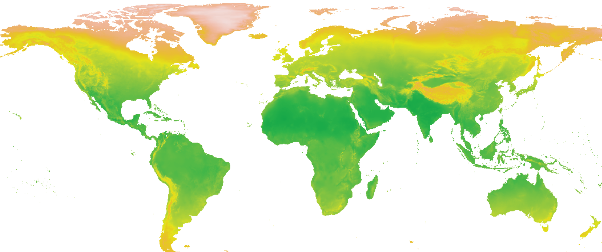

<link rel="shortcut icon" href="favicon.ico">

<figure>
  
</figure>

Lessons: 

1. **The Basics of R / Manipulating datasets with Dplyr**
    - [Slides](https://jeanbaptisteguiffard.github.io/courses/data_climate/slides/Data_climate_cours_1.pdf)

2. **Graphic representations with GGplot**
    - [Slides](https://jeanbaptisteguiffard.github.io/courses/data_climate/slides/Data_climate_cours_2.pdf)

3. **Making maps with R**
    - [Slides](https://jeanbaptisteguiffard.github.io/courses/data_climate/slides/Data_climate_cours_3.pdf)
    
4. **Web scraping with R**
    - [Slides](https://jeanbaptisteguiffard.github.io/courses/data_climate/slides/Data_climate_cours_4.pdf)

5. **Extracting and analyzing textual data with R**
    - [Slides]()

[All Files (scripts and databases)](https://github.com/jeanbaptisteguiffard/jeanbaptisteguiffard.github.io/tree/gh-pages/courses/data_climate/training/course_1)
    