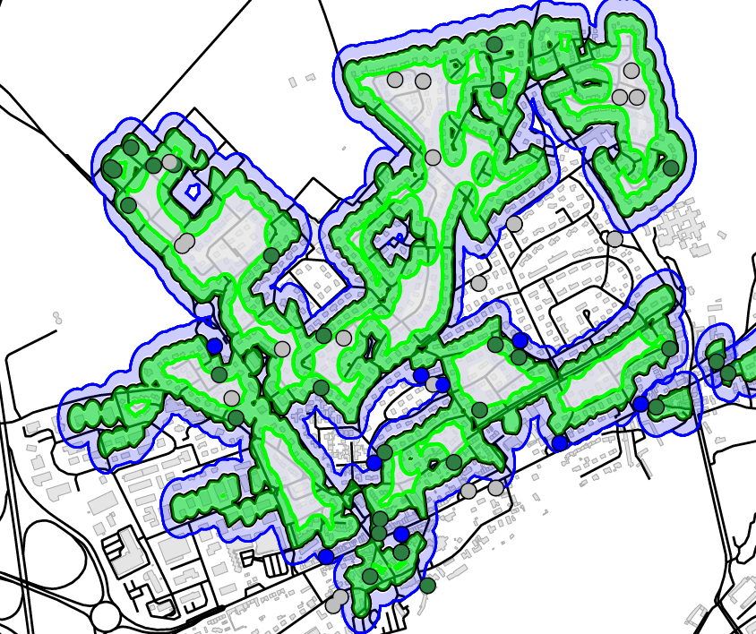

<link rel="shortcut icon" href="favicon.ico">

  

<h2 class="section-title">About Me</h2>

I'm a 5th year PhD student at the [UMR Développement & Sociétés](https://umr-devsoc.pantheonsorbonne.fr/) (IRD/ Université Paris 1 Panthéon-Sorbonne) and a teaching assistant (ATER) in development economics at the [Sorbonne Institute of Development Studies](https://iedes.pantheonsorbonne.fr/) (Université Paris 1 Panthéon-Sorbonne).

My research interests are in digital economics, with a particular focus on development economics. My thesis provides three impact evaluations of broadband internet deployment on various outcomes (political mobilization, house market, firms' choice of location...). My thesis advisors are [Mohamed Ali Marouani](https://sites.google.com/view/mohamedali-marouani/rieme-conference-paris) and [François Roubaud](https://dial.ird.fr/membres/membres-permanents/roubaud-francois/).

Thank you for visiting my website and learning more about my research interests. I look forward to sharing my findings with you in the future.

- Member of the [International Telecommunications Society](https://www.itsworld.org/)
- Member of the [AFEDEV network](https://afedev.fr/)
- Co-organizer of the [AuToMat Seminar](https://jeanbaptisteguiffard.github.io/automat.html)
- Co-organizer of the [Journée d'études sur les données spatiales](https://umr-devsoc.pantheonsorbonne.fr/actualite/journee-detudes-donnees-spatiales-nouvelles-sources-nouvelles-perspectives)

<h2 class="section-title">Contact</h2>

  
<strong>Workplace:</strong> 45 bis Avenue de la Belle Gabrielle, 94130, Nogent-sur-Marne, France

  
<strong>Email:</strong> <a href="mailto:jean-baptiste.guiffard@univ-paris1.fr">jean-baptiste.guiffard@univ-paris1.fr</a>

  
  
  
  

  <h2 class="section-title">Research</h2>
  <h2 class="section-title">Publications</h2>

  

 [**Valuing the Virtual: The Impact of Fiber to the Home on Property Prices in France**](https://doi.org/10.1016/j.telpol.2024.102732) - *Telecommunications Policy, Volume 48, Issue 4, 2024* ([PDF](https://jeanbaptisteguiffard.github.io/docs/articles/1-s2.0-S0308596124000296-main.pdf))

This paper examines the value that households place on very high-speed internet access, explicitly focusing on the impact of eligibility for Fiber to the Home (FTTH) technology on property prices. Using a Spatial Discontinuity Design based on the border of fiber eligibility zones which have significantly expanded under France's *Plan Très Haut-Débit*, I find that FTTH eligibility is a significant determinant of property prices, with an average increase of 0.9 percent. I also consider heterogeneities in FTTH valuation, accounting for socioeconomic characteristics, local factors, and the performance of legacy copper networks. These findings highlight the growing importance of fast and reliable broadband access for households and have important implications for policymakers and Internet service providers.

<!---

--->

----

  

[**Impact of Broadband Internet on Preventive Healthcare Behaviours in Senegal**](https://www.insee.fr/en/statistiques/8186105?sommaire=8186112) (with [Pauline Kergall](https://sites.google.com/view/paulinekergall/home?authuser=0)) - *Economie et Statistique / Economics and Statistics, 542, 99–123, 2024* ([EN](https://jeanbaptisteguiffard.github.io/docs/articles/06_ES542_Kergall-Guiffard_EN.pdf)/[FR](https://jeanbaptisteguiffard.github.io/docs/articles/06_ES542_Kergall-Guiffard_FR.pdf))

In sub-Saharan African (SSA) countries the main channels of morbidity and mortality are preventable and treatable diseases. Yet, SSA countries invest little in preventive healthcare. Available literature has shown that providing health information can have an impact on health behaviors. In SSA, most of the internet traffic (fixed and mobile) goes through backbone networks. The arrival of optic fiber submarine cables in 2010 brought broadband connectivity to Senegal, allowing access to healthcare information online. Using the Demographic and Health Surveys (DHS) datasets combined with the Afterfibre database, and a Difference-in-Difference methodology, this study aims to assess the impact of the arrival of broadband internet on preventive health behaviors in Senegal. Broadband access is found to be positively associated with the use of bednet, mixed results are found regarding the use of antenatal care, while no impact on child immunization is found. If the positive impacts of internet access are confirmed, the expansion of broadband internet could have important positive spillover effects to improve health through increased access to information.

<h2 class="section-title">Work in Progress</h2>

  

**From Connection to Coordination: High-Speed Internet and Protests in Africa** 

What is the role of broadband Internet in shaping political participation in Africa? This study leverages the staggered arrival of submarine Internet cables and the terrestrial backbone network in Africa to examine the influence of high-speed Internet on protests. Combining large-scale cross-country surveys on political behaviors and disaggregated data on conflict events, robust difference-in-differences estimates indicate a significant increase in both the likelihood of protest participation and the frequency of protests. This effect is particularly observed in countries that actively exercise political rights and civil liberties. The analysis explores two key mechanisms---information dissemination and coordination facilitation---with the latter identified as the predominant factor influencing the observed effects.

<!---
- [Working Paper](https://papers.ssrn.com/sol3/papers.cfm?abstract_id=4247083)
--->

----

  

**Welfare Cost of Mobile Spectrum (Mis)allocation** (with [Marc Ivaldi](https://www.tse-fr.eu/fr/people/marc-ivaldi), [Julienne Liang](https://www.researchgate.net/profile/Julienne-Liang) and Louise Aïmène) - [Working Paper](https://papers.ssrn.com/sol3/papers.cfm?abstract_id=4228058)

The conditions of spectrum allocation or reallocation are significant in determining the market structure in the telecom sector which in turn affects the prices and the quality of mobile networks. In a more concentrated market, the quantity of spectrum is less diluted, and operators can offer higher quality to their customers; In a more competitive market, where there are more operators, consumers can benefit from a lower price but at the expense of less spectrum for each operator. To address this trade-off, we first fit a demand model of mobile telecommunications services on a unique panel database for 23 MNOs of five major European countries from 2004Q3 to 2021Q4. Notably, we provide an adequate proxy of the mobile network quality for consumers by combining coverage data with spectrum data. Using this estimated demand model, we conduct a counterfactual simulation to measure the effect on consumer surplus of the incomplete spectrum allocation and the arrival of an additional operator in Germany. Results show that reallocating additional spectrum to three instead of four operators is consumer welfare improving as prices do not increase much while quality is significantly improved.

----

  

**From Bytes to Business: Mobile Broadband, Firm Creations and Digital Divide in Tunisia** (with [Mohamed Ali Marouani](https://sites.google.com/view/mohamedali-marouani/home))

This paper investigates the impact of mobile broadband Internet on business creation in Tunisia. Using a rich dataset of Tunisian delegations, the study employs a count model to assess the influence of mobile broadband Internet quality and other infrastructure and delegation characteristics on firm location decisions. The empirical findings demonstrate a robust positive relationship between the density of 4G antennas per 10,000 inhabitants and the number of new business creations. Notably, this relationship is stronger and exhibits later effects in rural areas, particularly on the peripheries of major urban centers, suggesting varying rates of technology adoption and challenging the hypothesis of the ``death of distance" that broadband Internet was expected to bring. This research highlights the potential role of mobile broadband in stimulating local economic growth and sheds nuanced light on the economic implications of the digital divide.

<!---

  <h2 class="section-title">Courses and Resources</h2>
  <!-- Courses content here -->

  <h2 class="section-title">Séminaire AuToMat</h2>
  <!-- Seminar content here -->

---->

  <!-- Social media links here -->

