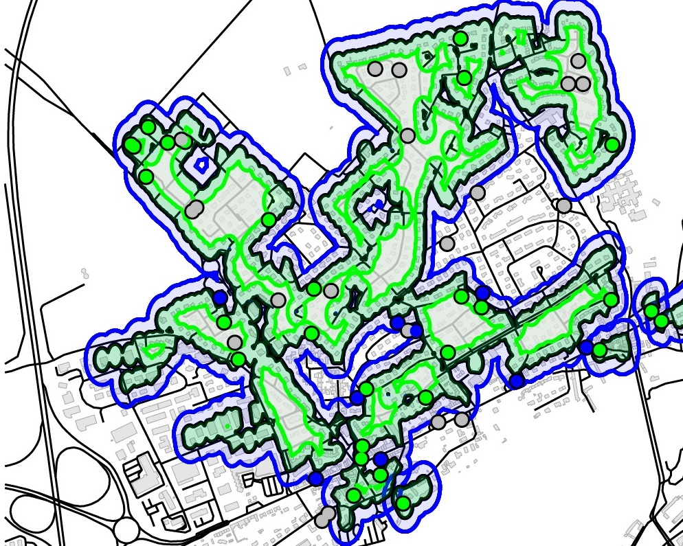
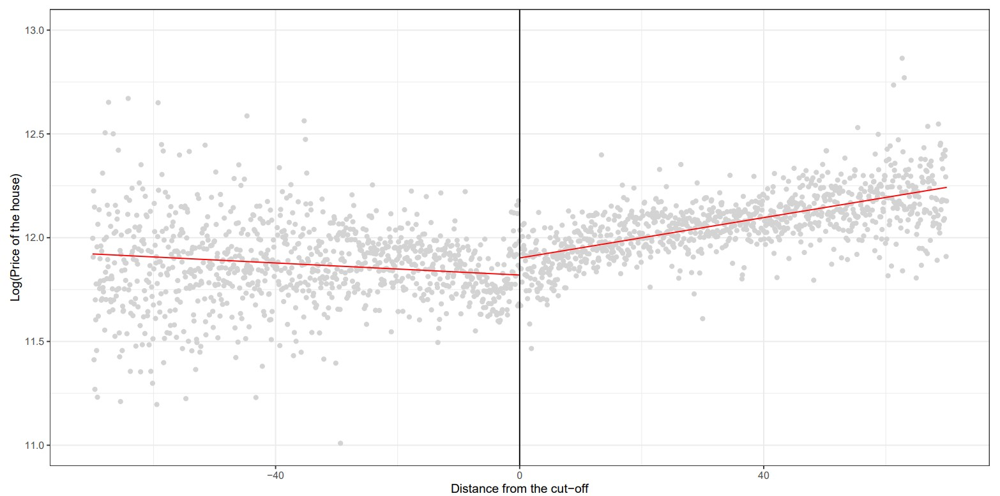
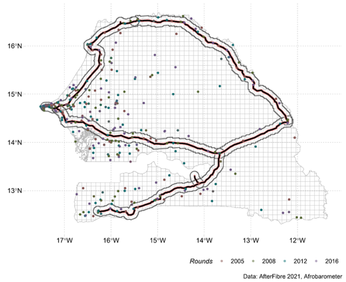
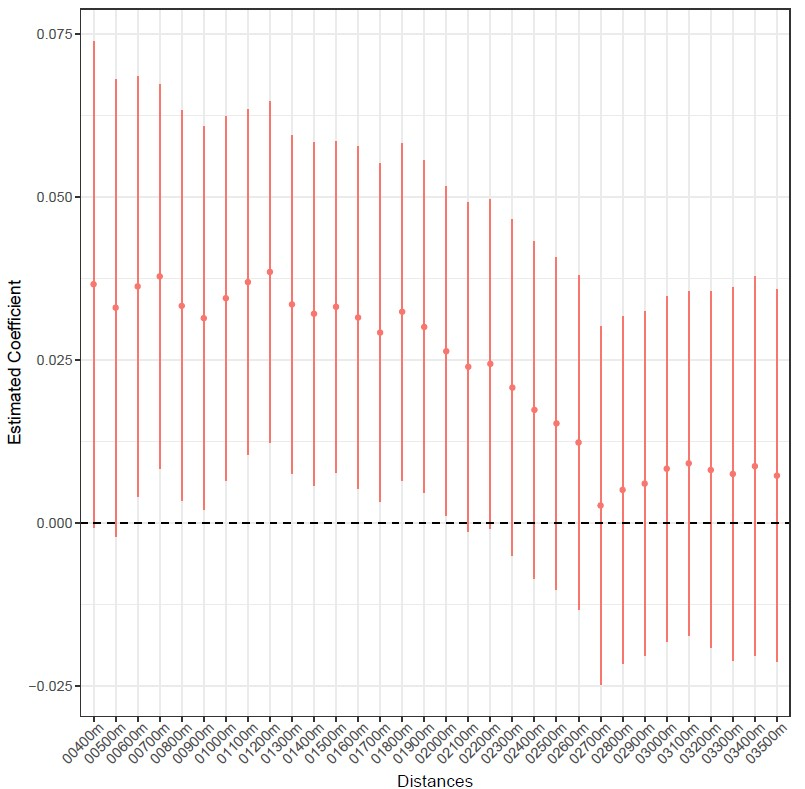
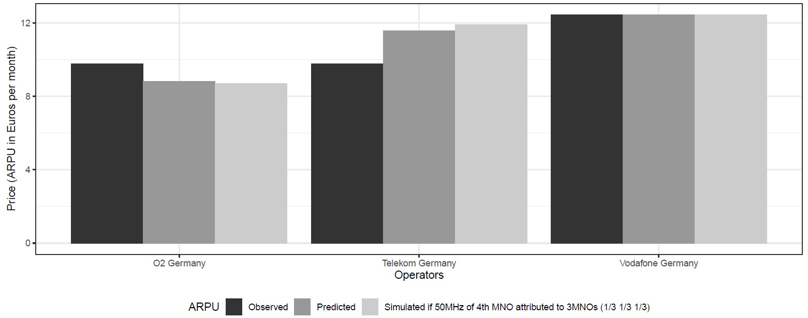

----

**Measuring the consumer's valuation of High-Speed Internet: The Impact of FTTH deployment on the House Market in France** - [Poster](https://jeanbaptisteguiffard.github.io/mywebsite/Poster_Doctorissimes_Guiffard_2023.pdf)

This paper examines the value that households place on broadband internet access, explicitly focusing on the impact of eligibility for Fiber to the Home (FTTH) technology on property prices. Using a Spatial Discontinuity Design based on the border of fiber eligibility zones which have significantly expanded under France's Plan Très Haut-Débit, I find that FTTH eligibility is a significant determinant of home prices, with an average increase of 1.8 percent. These findings highlight the growing importance of fast and reliable Internet access for households and have important implications for policymakers and Internet service providers.

```{r, echo=FALSE, out.width="50%"}

#
```

----

**The Impact of Broadband Internet on Political Mobilization in Sub-Saharan Africa** - [Working Paper](https://papers.ssrn.com/sol3/papers.cfm?abstract_id=4247083)

I use the gradual arrival of submarine Internet cables on the coast and the route of the backbone cables network to demonstrate how high-speed Internet (fixed and mobile jointly considered) has an impact on political mobilization in Africa. I obtained robust difference-in-differences estimates using Afrobarometer data from ten countries, which reveal a positive effect on the likelihood of participating in a protest. Since having access to high-speed Internet allows access to social networks and other content, two mechanisms are explored to explain this positive impact: information and coordination channels. The main explanatory channel appears to be the enhanced coordination.


```{r, echo=FALSE, out.width="50%"}


```


----

**Welfare Cost of Mobile Spectrum (Mis)allocation** (with Marc Ivaldi, Julienne Liang and Louise Aïmène) - [Working Paper](https://papers.ssrn.com/sol3/papers.cfm?abstract_id=4228058) (Submitted)

The conditions of spectrum allocation or reallocation are significant in determining the market structure in the telecom sector which in turn affects the prices and the quality of mobile networks. In a more concentrated market, the quantity of spectrum is less diluted, and operators can offer higher quality to their customers; In a more competitive market, where there are more operators, consumers can benefit from a lower price but at the expense of less spectrum for each operator. To address this trade-off, we first fit a demand model of mobile telecommunications services on a unique panel database for 23 MNOs of five major European countries from 2004Q3 to 2021Q4. Notably, we provide an adequate proxy of the mobile network quality for consumers by combining coverage data with spectrum data. Using this estimated demand model, we conduct a counterfactual simulation to measure the effect on consumer surplus of the incomplete spectrum allocation and the arrival of an additional operator in Germany. Results show that reallocating additional spectrum to three instead of four operators is consumer welfare improving as prices do not increase much while quality is significantly improved.


```{r, echo=FALSE, out.width="50%"}
knitr::include_graphics("images/marginal_cost_MNO_germany.jpg")

```


<!---
----

**The Relationship between License Duration and Telecom Investment in Africa and the Middle East: an Econometric Analysis** 

This research project links investment in the telecommunications sector and one of the terms of the regulatory framework for this sector, the mobile licence duration in African and Middle-eastern countries. Using World Cellular Information Service and Worldwide Governance Indicators data, we were able to build a database combining the amount of CAPEX per capita with the license duration (the average duration of all active licenses) adding governance quality indicators for 13 developing countries in Africa and the Middle East over a 9-year period. Based on an OLS estimate, we found that the licence duration has a positive effect on investment provided that the political stability of the country is above a certain threshold.

--->

