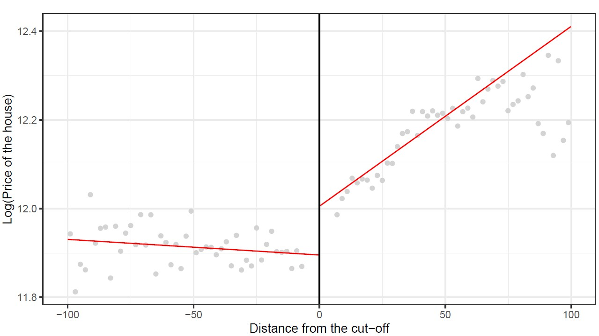

<link rel="shortcut icon" href="favicon.ico">


----

**The Impact of Broadband Internet on Political Mobilization in Sub-Saharan Africa** - [Working Paper](https://papers.ssrn.com/sol3/papers.cfm?abstract_id=4247083)

I use the gradual arrival of submarine Internet cables on the coast and the route of the backbone cables network to demonstrate how high-speed Internet (fixed and mobile jointly considered) has an impact on political mobilization in Africa. I obtained robust difference-in-differences estimates using Afrobarometer data from ten countries, which reveal a positive effect on the likelihood of participating in a protest. Since having access to high-speed Internet allows access to social networks and other content, two mechanisms are explored to explain this positive impact: information and coordination channels. The main explanatory channel appears to be the enhanced coordination.


```{r, echo=FALSE, out.width="50%"}
knitr::include_graphics("images/plot_methodo_chap1_bon.jpeg")
knitr::include_graphics("images/coef_plot_backbone.jpg")
```


----

**Welfare Cost of Mobile Spectrum (Mis)allocation** (with [Marc Ivaldi](https://www.tse-fr.eu/fr/people/marc-ivaldi), [Julienne Liang](https://www.researchgate.net/profile/Julienne-Liang) and Louise Aïmène) - [Working Paper](https://papers.ssrn.com/sol3/papers.cfm?abstract_id=4228058)

The conditions of spectrum allocation or reallocation are significant in determining the market structure in the telecom sector which in turn affects the prices and the quality of mobile networks. In a more concentrated market, the quantity of spectrum is less diluted, and operators can offer higher quality to their customers; In a more competitive market, where there are more operators, consumers can benefit from a lower price but at the expense of less spectrum for each operator. To address this trade-off, we first fit a demand model of mobile telecommunications services on a unique panel database for 23 MNOs of five major European countries from 2004Q3 to 2021Q4. Notably, we provide an adequate proxy of the mobile network quality for consumers by combining coverage data with spectrum data. Using this estimated demand model, we conduct a counterfactual simulation to measure the effect on consumer surplus of the incomplete spectrum allocation and the arrival of an additional operator in Germany. Results show that reallocating additional spectrum to three instead of four operators is consumer welfare improving as prices do not increase much while quality is significantly improved.


```{r, echo=FALSE, out.width="50%"}
knitr::include_graphics("images/marginal_cost_MNO_germany.jpg")
knitr::include_graphics("images/simulation_mno_germany.jpg")
```


----

**Valuing the Virtual: The Impact of Fiber to the Home (FTTH) on Property Prices in France** - *Review and Resubmit*

This paper examines the value that households place on very high-speed internet access, explicitly focusing on the impact of eligibility for Fiber to the Home (FTTH) technology on property prices.
Using a Spatial Discontinuity Design based on the border of fiber eligibility zones which have significantly expanded under France's Plan *Très Haut-Débit*, I find that FTTH eligibility is a significant determinant of property prices, with an average increase of 0.9 percent. I also consider heterogeneities in FTTH valuation based on socioeconomic characteristics, local factors and income levels. These findings highlight the growing importance of fast and reliable broadband access for households and have important implications for policymakers and Internet service providers.

```{r, echo=FALSE, out.width="50%"}
knitr::include_graphics("images/map_rdd_ftth.jpg")

```


----

**From Bytes to Business: Evaluating the Role of Broadband in Firm Location Decisions** (with [Mohamed Ali Marouani](https://sites.google.com/view/mohamedali-marouani/home))

<!---

This paper investigates the impact of mobile broadband Internet on business creation in Tunisia, a critical topic given the country's economic challenges. Using a rich dataset of Tunisian delegations, the study employs a count model to assess the influence of mobile broadband Internet quality on firm location decisions. The findings reveal a significant positive relationship between the density of 4G antennas per 10,000 inhabitants and the rate of new business creation. However, this effect is not observed in rural areas, suggesting potential differences in technology adoption.
The research highlights the potential role of mobile broadband Internet in fostering local economic growth, emphasizing the need for policymakers to consider contextual factors.

```{r, echo=FALSE, out.width="50%"}
knitr::include_graphics("images/tunisie_maps_chap3.jpg")
```


----

**The Relationship between License Duration and Telecom Investment in Africa and the Middle East: an Econometric Analysis** 

This research project links investment in the telecommunications sector and one of the terms of the regulatory framework for this sector, the mobile licence duration in African and Middle-eastern countries. Using World Cellular Information Service and Worldwide Governance Indicators data, we were able to build a database combining the amount of CAPEX per capita with the license duration (the average duration of all active licenses) adding governance quality indicators for 13 developing countries in Africa and the Middle East over a 9-year period. Based on an OLS estimate, we found that the licence duration has a positive effect on investment provided that the political stability of the country is above a certain threshold.

--->

----

**Impact of broadband internet on preventive healthcare behaviors in Senegal** (with [Pauline Kergall](https://sites.google.com/view/paulinekergall/home?authuser=0)) - *Conditionally accepted* in *Economics and Statistics*

In sub-Saharan African (SSA) countries the main channels of morbidity and mortality are preventable
and treatable diseases. Yet, SSA countries invest little in preventive healthcare. Available literature
has shown that providing health information can have an impact on health behaviors. In SSA, most of
the internet traffic (fixed and mobile) goes through backbone networks. The arrival of optic fiber
submarine cables in 2010 brought broadband connectivity to Senegal, allowing access to healthcare
information online. Using the Demographic and Health Surveys (DHS) datasets combined with the
Afterfibre database, and a Difference-in-Difference methodology, this study aims to assess the
impact of the arrival of broadband internet on preventive health behaviors in Senegal. Broadband
access is found to be positively associated with the use of bednet, mixed results are found regarding
the use of antenatal care, while no impact on child immunization is found. If the positive impacts of
internet access are confirmed, the expansion of broadband internet could have important positive
spillover effects to improve health through increased access to information.

